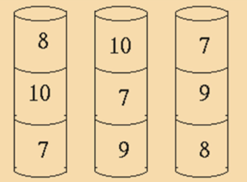

# The can problem
This was a maths problem set at a school. Not hard but it took me 10 mins to see the solution. I wanted to see how an LLM would do. They were given the image and my prompt not the question posed to the kids.
  
 
  
Kids question:  
At a fairground stall there are 3 piles of cans.  
You get 3 throws.  
You can only knock off the top can of a pile.  
Each throw scores according to the number of the can.  
The 2nd throw counts double, the 3rd triple.  
How do you score exactly 50? 

Prompt:  
"I would like Python code to do the following based on the image. The image represents nine cans with numbers on. The cans are arranged in vertical piles of 3. You have 3 throws of a ball at the cans and the objective is to score 50. You score by knocking a can off the vertical piles. You can only knock off the top can. The first throw scores the number on the can, the second throw scores twice the number of the next can and the third 3 times the number on the can. Once a top can is knocked off you may knock of the one that was below which is the new top can.  Please generate code that shows which cans must be hit to score 50."

Result:  
ChatGPT 4 got it right using the "Crewe AI Assistant" variant, I think it's correct having only tried a couple of tests.
I ended up adding a bit to format the answer how I wanted, that bit failed with prompts but it coded the literal answer correctly. I also tried Bard, Copilot and CodeLlama. They failed consistently even after adjusting the prompt several times.
 
